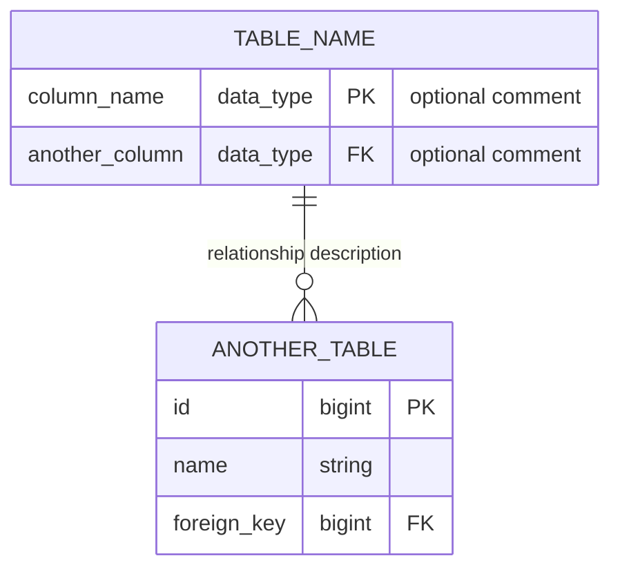

# Laravel Starter Kit Development Guidelines

This document provides essential information for developers working on this Laravel Starter Kit project.

## Build/Configuration Instructions

### Prerequisites
- PHP 8.2 or higher
- Composer
- Node.js and npm
- A database (SQLite, MySQL, PostgreSQL)

### Initial Setup
1. Clone the repository
2. Install PHP dependencies:
   ```bash
   composer install
   ```
3. Install JavaScript dependencies:
   ```bash
   npm install
   ```
4. Create environment file:
   ```bash
   cp .env.example .env
   ```
5. Generate application key:
   ```bash
   php artisan key:generate
   ```
6. Configure your database in the `.env` file
7. Run migrations:
   ```bash
   php artisan migrate
   ```
8. Sync modules:
   ```bash
   php artisan modules:sync
   ```

### Development Server
Run the development server with a single command that starts Laravel server, queue worker, logs, and Vite:
```bash
composer dev
```

For SSR (Server-Side Rendering):
```bash
composer dev:ssr
```

### Building for Production
```bash
npm run build
```

For SSR:
```bash
npm run build:ssr
```

## Testing Information

### Testing Framework
This project uses Pest PHP, a testing framework built on top of PHPUnit, with a more expressive syntax.

### Test Structure
Tests are organized in three main locations:
- `tests/Unit/` - Unit tests
- `tests/Feature/` - Feature tests
- `app-modules/*/tests/` - Module-specific tests

### Running Tests
Run all tests:
```bash
composer test
```

Run specific test file:
```bash
php artisan test path/to/test/file.php
```

Run tests with coverage report:
```bash
php artisan test --coverage
```

### Creating Tests
1. Create a new test file in the appropriate directory
2. Use the Pest syntax for writing tests:
   ```php
   <?php

   declare(strict_types=1);

   use Illuminate\Foundation\Testing\RefreshDatabase;

   uses(RefreshDatabase::class);

   test('feature works as expected', function (): void {
       // Arrange
       $data = [...];

       // Act
       $result = doSomething($data);

       // Assert
       expect($result)->toBe(true);
   });
   ```

3. Use factories to create test data:
   ```php
   $user = User::factory()->create();
   $workspace = Workspace::factory()->create(['user_id' => $user->id]);
   ```

4. Use the `expect()` function for assertions:
   ```php
   expect($result)->toBe(true);
   expect($collection)->toHaveCount(5);
   expect($model)->toBeInstanceOf(Model::class);
   ```

### Test Example
Here's a simple test for the Workspace model:

```php
<?php

declare(strict_types=1);

use Modules\Workspace\Models\Workspace;
use Illuminate\Foundation\Testing\RefreshDatabase;

uses(RefreshDatabase::class);

test('workspace has expected attributes', function (): void {
    // Arrange
    $name = 'Test Workspace';

    // Act
    $workspace = Workspace::factory()->create([
        'name' => $name,
    ]);

    // Assert
    expect($workspace->name)->toBe($name);
    expect($workspace->owner)->not()->toBeNull();
    expect($workspace->users)->toBeInstanceOf(\Illuminate\Database\Eloquent\Collection::class);
});
```

## Additional Development Information

### Code Style
This project follows the Laravel coding style with some additional rules:
- Strict types are required (`declare(strict_types=1);`)
- Class elements must be ordered according to the configuration in `pint.json`
- Void return types must be explicitly declared

### Code Formatting
Format code using Laravel Pint:
```bash
composer format
```

Format JavaScript and Vue files:
```bash
npm run format
```

Check JavaScript and Vue formatting without fixing:
```bash
npm run format:check
```

### Linting
Lint JavaScript and Vue files:
```bash
npm run lint
```

### IDE Helper
Generate IDE helper files for better autocompletion:
```bash
composer ide-helper
```

### Modular Structure
The project uses a modular structure with modules in the `app-modules` directory. Each module can have its own:
- Controllers
- Models
- Views
- Routes
- Tests
- Migrations
- Factories

### Database Entity Relationship Diagrams
The project maintains a database entity relationship diagram (ERD) to visualize the database schema. The diagram is created using Mermaid syntax and is stored in `docs/database-entity-relationship-diagram.md`.

#### Mermaid ERD Syntax
The ERD is created using Mermaid's entity-relationship diagram syntax. Here's an example of the syntax:



Key points about the syntax:
- Each table is defined with its name followed by columns in curly braces
- Columns include name, data type, and optional attributes (PK, FK)
- Comments can be added in quotes after the column definition
- Relationships are defined using crow's foot notation
- Avoid using "NULL" in attribute definitions as it causes parsing errors

#### Updating the ERD
When making changes to the database schema (adding tables, columns, or relationships), follow these steps to update the ERD:

1. Open `docs/database-entity-relationship-diagram.md`
2. Update the Mermaid diagram to reflect the changes
3. Add or modify table descriptions as needed
4. Update the relationships section if necessary

The ERD should be kept in sync with the migration files to ensure it accurately represents the current database schema.

### Frontend
- Vue.js 3 with TypeScript
- Inertia.js for server-side rendering
- Tailwind CSS for styling
- Vite for asset compilation

### Internationalization
The project supports multiple languages using Vue I18n. Translation files are located in:
- `lang/` directory for PHP translations
- `app-modules/*/lang/` directories for module-specific translations

Always create translation files for both English and German:
- `en.json` - English translations
- `de.json` - German translations

This ensures that the application is fully accessible to users in both languages.

### Workspace Module
The Workspace module provides multi-tenancy features:
- Users can create and manage workspaces
- Users can be invited to workspaces
- Users can switch between workspaces
- Resources can be scoped to workspaces

## Module Development

A comprehensive guide for creating new modules is available in `docs/module-development-guide.md`. This section provides a summary of the key points.

### Module Structure
Each module should follow this directory structure:

```
app-modules/
└── your-module/
    ├── README.md
    ├── composer.json
    ├── database/
    │   ├── factories/
    │   ├── migrations/
    │   └── seeders/
    ├── lang/
    ├── resources/
    │   ├── js/
    │   │   ├── pages/
    │   │   ├── plugin.ts
    │   │   └── types.ts
    │   └── views/
    ├── routes/
    │   └── web.php
    ├── src/
    │   ├── Http/
    │   │   ├── Controllers/
    │   │   └── Requests/
    │   ├── Models/
    │   └── Providers/
    └── tests/
        ├── Feature/
        └── Unit/
```

### Creating a New Module
1. Create the module directory structure
2. Create a `composer.json` file with the module's namespace and service provider
3. Implement the backend components (models, controllers, requests, routes, migrations)
4. Create Vue.js frontend components
5. Write Pest tests for the module
6. Document the module in a README.md file

### Vue.js Views
When creating Vue.js views for a module:

1. Create components in the `resources/js/pages/` directory
2. Use TypeScript for type safety
3. Use shadcn-vue components for UI elements
4. Register components in the module's `plugin.ts` file
5. Create translations in the module's `lang/` directory

Example of a Vue.js component registration in `plugin.ts`:

```typescript
export default definePlugin(({ app, route }) => {
    // Register components
    app.component('your-module::Index', () => import('./pages/Index.vue'));
    app.component('your-module::Create', () => import('./pages/Create.vue'));

    // Register routes
    route('your-module.index', (): RouteLocationRaw => {
        return { name: 'your-module.index' };
    });
});
```

### Pest Tests
When writing tests for a module, use Pest PHP for a more expressive syntax:

1. Create unit tests in `tests/Unit/` directory
2. Create feature tests in `tests/Feature/` directory
3. Use the `expect()` function for assertions
4. Use the `uses()` function to apply traits like `RefreshDatabase`

Example of a Pest test:

```php
<?php

declare(strict_types=1);

use App\Models\User;
use Illuminate\Foundation\Testing\RefreshDatabase;
use Modules\YourModule\Models\YourModel;

uses(RefreshDatabase::class);

test('it can be instantiated using factory', function (): void {
    $item = YourModel::factory()->create();

    expect($item)->toBeInstanceOf(YourModel::class)
        ->and($item->id)->toBeInt()
        ->and($item->title)->toBeString();
});
```

### Integration with Workspace
When integrating a module with the workspace concept:

1. Add a `workspace_id` foreign key to your model's table
2. Add a relationship to the Workspace model in your model
3. Filter queries by the current workspace's ID
4. Ensure that users can only access resources that belong to their current workspace

For more detailed information, refer to the comprehensive guide in `docs/module-development-guide.md`.
