# Database Entity Relationship Diagram

This document provides a visual representation of the database schema for the Laravel Starter Kit project.

## Entity Relationship Diagram

```mermaid
erDiagram
    users {
        id bigint PK
        name string
        email string UK
        email_verified_at timestamp
        password string
        remember_token string
        locale string "default en"
        preferred_notification_channels longtext
        workspace_id bigint FK
        created_at timestamp
        updated_at timestamp
    }

    password_reset_tokens {
        email string PK
        token string
        created_at timestamp
    }

    sessions {
        id string PK
        user_id bigint FK "index, nullable"
        ip_address string "nullable"
        user_agent text "nullable"
        payload longtext
        last_activity integer "index"
    }

    cache {
        key string PK
        value mediumtext
        expiration integer
    }

    cache_locks {
        key string PK
        owner string
        expiration integer
    }

    jobs {
        id bigint PK
        queue string "index"
        payload longtext
        attempts tinyint
        reserved_at integer "nullable"
        available_at integer
        created_at integer
    }

    job_batches {
        id string PK
        name string
        total_jobs integer
        pending_jobs integer
        failed_jobs integer
        failed_job_ids longtext
        options mediumtext "nullable"
        cancelled_at integer "nullable"
        created_at integer
        finished_at integer "nullable"
    }

    failed_jobs {
        id bigint PK
        uuid string UK
        connection text
        queue text
        payload longtext
        exception longtext
        failed_at timestamp "default current timestamp"
    }

    notifications {
        id uuid PK
        type string
        notifiable_type string
        notifiable_id bigint
        data text
        read_at timestamp
        created_at timestamp
        updated_at timestamp
    }

    workspaces {
        id bigint PK
        user_id bigint FK "index"
        name string
        created_at timestamp
        updated_at timestamp
    }

    workspace_member_invitations {
        id bigint PK
        workspace_id bigint FK
        email string
        role string "default null"
        created_at timestamp
        updated_at timestamp
        UK "workspace_id, email"
    }

    workspace_members {
        id bigint PK
        workspace_id bigint FK
        user_id bigint FK
        role string "default null"
        created_at timestamp
        updated_at timestamp
        UK "workspace_id, user_id"
    }

    todos {
        id bigint PK
        workspace_id bigint FK "index"
        user_id bigint FK "index"
        title string
        completed boolean "default false"
        created_at timestamp
        updated_at timestamp
    }

    passkeys {
        id bigint PK
        authenticatable_id bigint FK
        name text
        credential_id text
        data json
        last_used_at timestamp "nullable"
        created_at timestamp
        updated_at timestamp
    }

    pan_analytics {
        id bigint PK
        name string
        impressions unsignedBigInteger "default 0"
        hovers unsignedBigInteger "default 0"
        clicks unsignedBigInteger "default 0"
    }

    users ||--o{ sessions : "has many"
    users ||--o{ notifications : "has many"
    users ||--o{ workspaces : "owns many"
    users ||--o{ workspace_members : "belongs to many workspaces"
    users }|--o| workspaces : "has current active workspace"
    users ||--o{ todos : "is assigned to many todos"
    users ||--o{ passkeys : "has many"

    workspaces ||--o{ workspace_members : "has many members"
    workspaces ||--o{ workspace_member_invitations : "has many invitations"
    workspaces ||--o{ todos : "has many todos"
```

## Table Descriptions

### Core Tables
- **users**: Stores user account information
- **password_reset_tokens**: Manages password reset functionality
- **sessions**: Tracks user sessions

### Cache and Queue Tables
- **cache**: Stores cached data
- **cache_locks**: Manages cache locks
- **jobs**: Stores queued jobs
- **job_batches**: Manages batches of jobs
- **failed_jobs**: Tracks failed jobs

### Notification Tables
- **notifications**: Stores user notifications

### Workspace Tables
- **workspaces**: Stores workspace information
- **workspace_members**: Manages workspace membership
- **workspace_member_invitations**: Manages invitations to workspaces

### Todo Tables
- **todos**: Stores todo items with title, completion status, and relationships to workspaces and users

### Passkey Tables
- **passkeys**: Stores passkey authentication credentials for users, enabling passwordless login

### Analytics Tables
- **pan_analytics**: Stores analytics data for tracking user interactions (impressions, hovers, clicks)

## Relationships

- A user can own many workspaces
- A user can belong to many workspaces through workspace_members
- A user can have a current active workspace
- A workspace can have many members through workspace_members
- A workspace can have many invitations through workspace_member_invitations
- A workspace can have many todos
- A user can have many sessions
- A user can have many notifications
- A user can be assigned to many todos
- A user can have many passkeys for passwordless authentication
