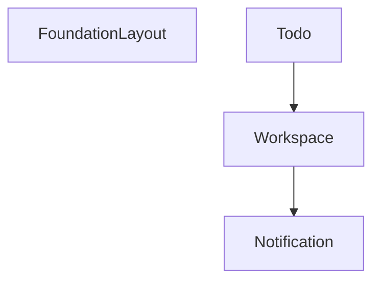

# Module Dependency Graph

This graph shows the dependencies between modules in the Laravel Starter Kit.

## Module Details

### FoundationLayout

The foundation layout domain handles configuration stuff regarding the used layout variant.

**No dependencies**

**Not used by other modules**

### Notification

Notification module to improve the user notification system.

**No dependencies**

**Used by:**

- Workspace

### Workspace

This module supports a workspace concept to form smaller tribes to collaborate in.

**Dependencies:**

- Notification

**Used by:**

- Todo

### Todo

This module provides todo functionality for workspaces, allowing users to create, view, update, and delete todos within their workspaces.

**Dependencies:**

- Workspace

**Not used by other modules**
