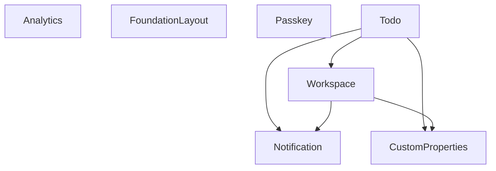

# Module Dependency Graph

This graph shows the dependencies between modules in the Laravel Starter Kit.

## Module Details

### Analytics

This module provides tracking and visualization of user interactions with elements in the application.

**No dependencies**

**Not used by other modules**

### CustomProperties

This module provides a generic way to add custom properties to various models within a parent-child (definable - customizable) relationship.

**No dependencies**

**Used by:**

- Todo
- Workspace

### FoundationLayout

The foundation layout domain handles configuration stuff regarding the used layout variant.

**No dependencies**

**Not used by other modules**

### Notification

Notification module to improve the user notification system.

**No dependencies**

**Used by:**

- Todo
- Workspace

### Passkey

This module supports the passkey login option.

**No dependencies**

**Not used by other modules**

### Todo

This module provides todo functionality for workspaces.

**Dependencies:**

- Workspace
- Notification

**Not used by other modules**

### Workspace

This module supports a workspace concept to form smaller tribes to collaborate in.

**Dependencies:**

- Notification

**Used by:**

- Todo
